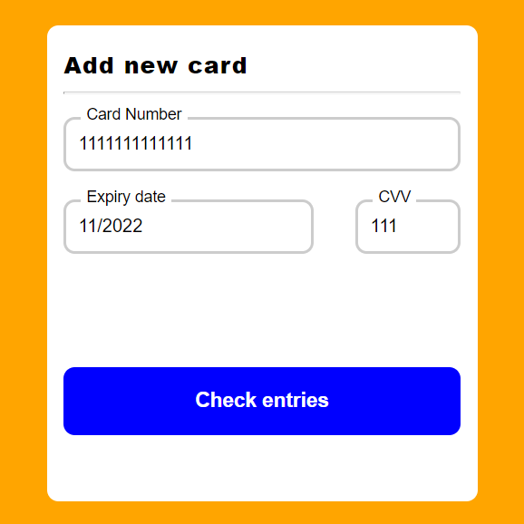
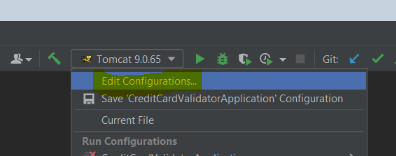
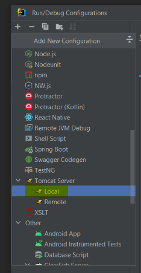
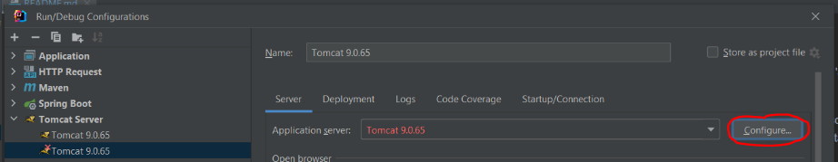
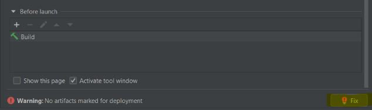
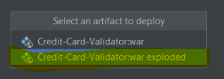
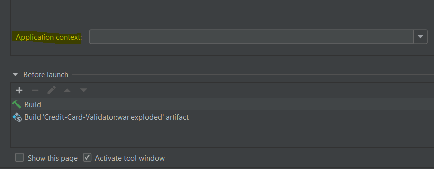
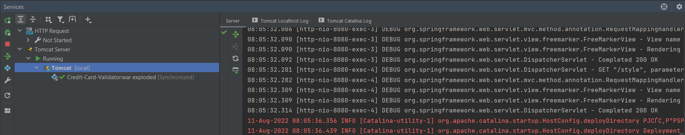

<div id="top"></div>

[![Contributors][contributors-shield]][contributors-url]
[![Stargazers][stars-shield]][stars-url]
[![Issues][issues-shield]][issues-url]


<!-- PROJECT LOGO -->
<br />
<div align="center">
    

<h2 align="center">Credit card validator</h2>

  <p align="center">
    Project description
    <br/>
    <a href="https://nik9695.github.io/Credit-Card-Validator/"><strong>Explore the docs »</strong></a>
  </p>
</div>


<!-- TABLE OF CONTENTS -->
<details>
  <summary>Table of Contents</summary>
  <ol>
    <li>
      <a href="#about-the-project">About The Project</a>
      <ul>
        <li><a href="#built-with">Built With</a></li>
      </ul>
    </li>
    <li><a href="#Application launch">Installation</a></li>
    <li><a href="#usage">Usage</a></li>
    <li><a href="#contributing">Contributing</a></li>
    <li><a href="#contact">Contact</a></li>
  </ol>
</details>


<!-- ABOUT THE PROJECT -->
## About The Project

Project is representing validation system for credit cards.

It is based on simple algorithms for checking :

- Card number (PAN)
- CVV code 
- Expiry date

Application consists of web page with forms for filling and backend API which responsible for validation algorithms.

Credit card validation carried out in several steps:

- it is required to fill all fields on the web page

  

<i>*Note: [Expiry date]() field need to be filled according to example mm/yyyy</i>

- in accordance with the information provided, on backend side instance of "CreditCardModel" class is creating
- all information in the "Credit card model" will be checked by service layer with "CreditCardService" class
- according to the results of all checks you will be forward to "passed validation page" or "failed validation page".

<p align="right">(<a href="#top">back to top</a>)</p>


### Built With

* [Java 8](https://www.oracle.com/java/technologies/java8.html)
* [Apache Maven](https://maven.apache.org/)
* [Spring MVC]()
* [Apache Tomcat]()

<p align="right">(<a href="#top">back to top</a>)</p>


## Application launch
1.Clone the repo:
   ```shell
   git clone https://github.com/Nik9695/Credit-Card-Validator.git
   ```
2.Build the project with [Maven]() :

   ```shell
  ...\Credit-Card-Validator mvn clean
  ...\Credit-Card-Validator mvn package
   ```

3.Configuring Intellij IDEA for deploy


- open "Edit Configurations" tab



- press "add new configuration" and choose "Tomcat server" -> "Local"



- press "configure" add specify path to already installed <u>[Apache Tomcat](https://tomcat.apache.org/)</u>



- press "Fix" button to mark artifacts for deployment



- choose artifact "Credit-Card-Validator:war exploded"



- Make sure that "Application context" field is empty. Configuration is finished, press "OK" to apply all changes



## Usage

Now it is possible to run the project :


After the launch you will get deployed project:



Also application will be opend in the browser:


<p align="right">(<a href="#top">back to top</a>)</p>


<!-- CONTRIBUTING -->
## Contributing

Contributions are what make the open source community such an amazing place to learn, inspire, and create. Any contributions you make are **greatly appreciated**.

If you have a suggestion that would make this better, please fork the repo and create a pull request. You can also simply open an issue with the tag "enhancement".
Don't forget to give the project a star! Thanks again!

1. Fork the Project
2. Create your Feature Branch (`git checkout -b feature/AmazingFeature`)
3. Commit your Changes (`git commit -m 'Add some AmazingFeature'`)
4. Push to the Branch (`git push origin feature/AmazingFeature`)
5. Open a Pull Request

<p align="right">(<a href="#top">back to top</a>)</p>


<!-- CONTACT -->
## Contact

Nikita Agureev - nagureev@gmail.com

Project Link: [https://github.com/Nik9695/Credit-Card-Validator](https://github.com/github_username/repo_name)

<p align="right">(<a href="#top">back to top</a>)</p>


<!-- MARKDOWN LINKS & IMAGES -->
<!-- https://www.markdownguide.org/basic-syntax/#reference-style-links -->

[contributors-shield]: https://img.shields.io/github/contributors/Nik9695/Credit-Card-Validator.svg?style=for-the-badge
[contributors-url]: https://github.com/Nik9695/Credit-Card-Validator/graphs/contributors

[stars-shield]: https://img.shields.io/github/stars/Nik9695/Credit-Card-Validator.svg?style=for-the-badge
[stars-url]: https://github.com/Nik9695/Credit-Card-Validator/stargazers

[issues-shield]: https://img.shields.io/github/issues/Nik9695/Credit-Card-Validator.svg?style=for-the-badge
[issues-url]: https://github.com/Nik9695/Credit-Card-Validator/issues


# Credit card validator
